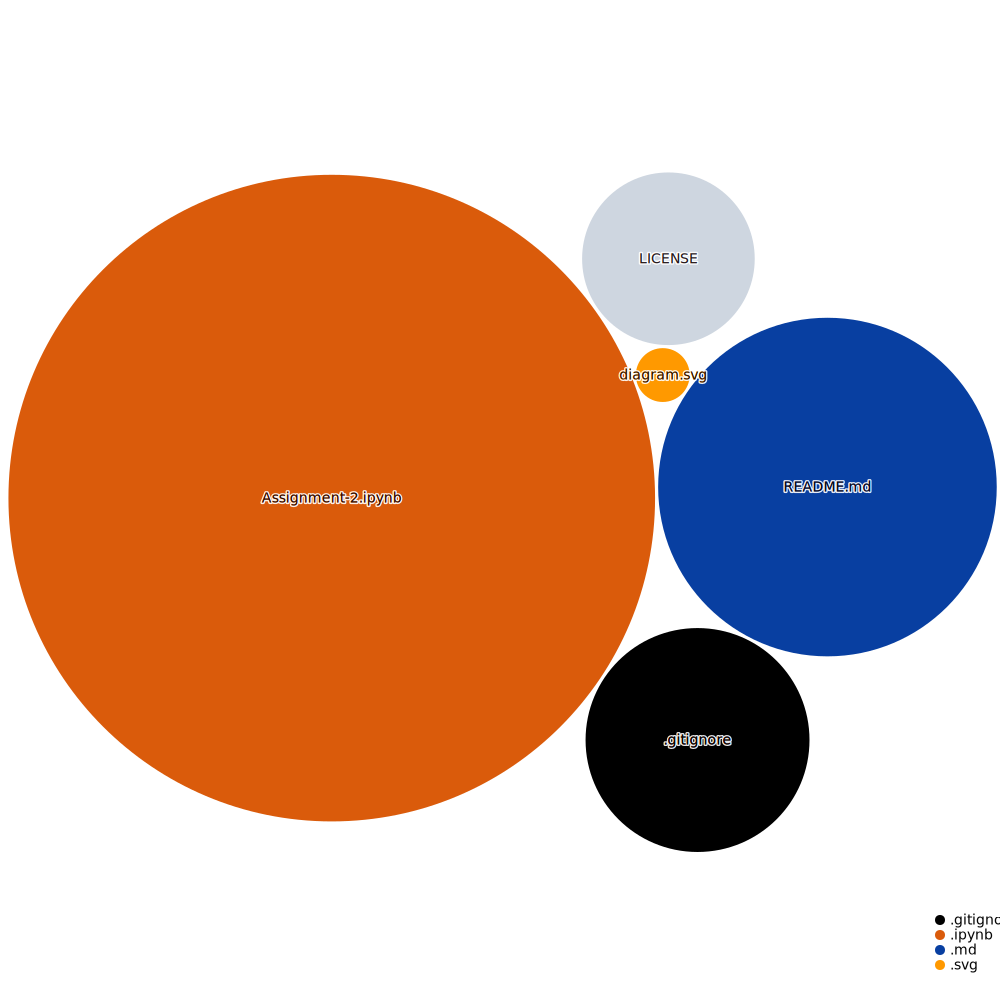

## Python Exercises

This repository contains Python practice exercises from the B.Financial Eng. in [ITESO](https://www.topuniversities.com/universities/iteso-universidad-jesuita-de-guadalajara) with
6 relatively simple exercises in which lists comprehensions, dictionaries, (anonymous) functions, loops, conditionals and other concepts are used to solve the problems.

 <i>Repository Tools:</i> 

##### Github Action:&nbsp; 
##### Main Text-Editor:&nbsp;&nbsp; 
##### Language:&nbsp; 
##### Libraries:&nbsp;&nbsp;&nbsp; 
##### Web-Interface:&nbsp;&nbsp; 
##### Version Control:&nbsp;&nbsp; 
  

##### License:&nbsp;

 <i>Contact:</i> 

   
 

   

[jancope](https://github.com/jancope)

 <i>Repository Visualization:</i> 

  
 

###### **References:** 
[`np.minimum.reduce`](https://docs.scipy.org/doc/numpy/reference/generated/numpy.ufunc.reduce.html)  
